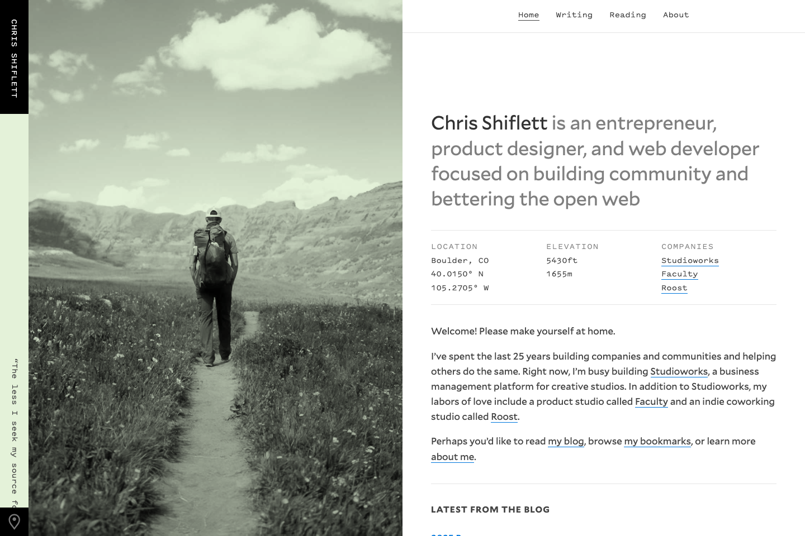
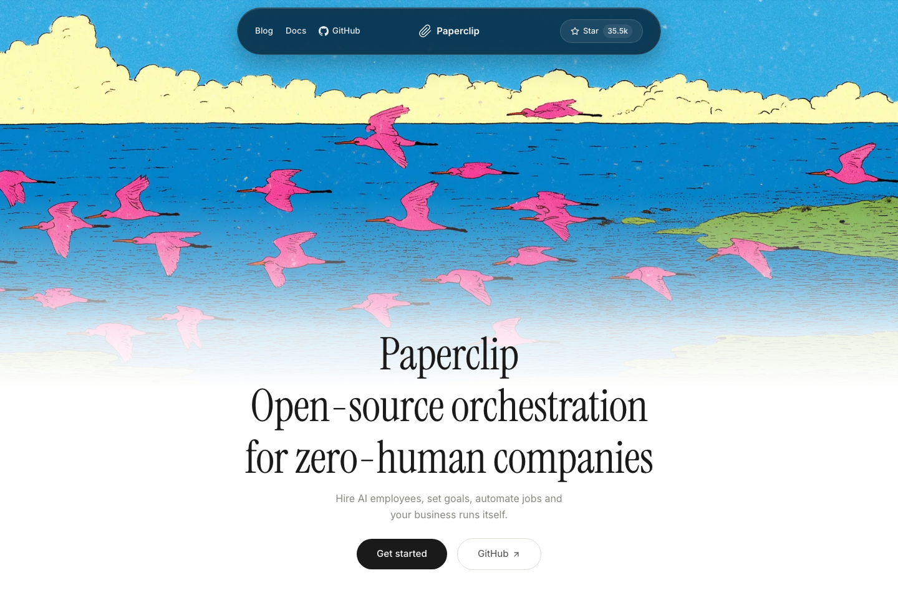
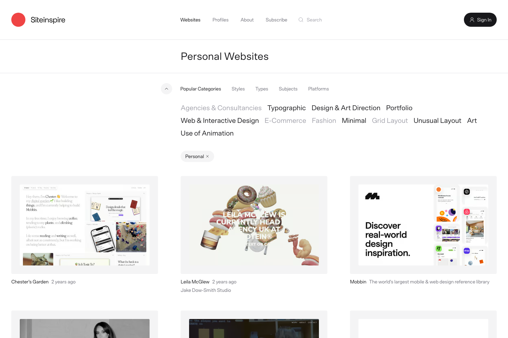
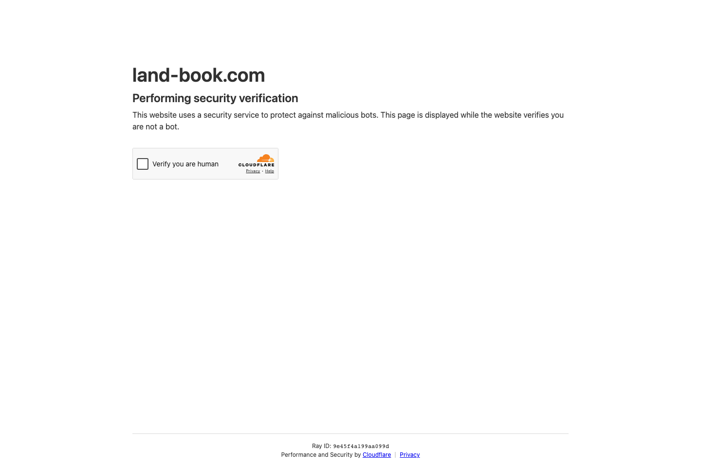
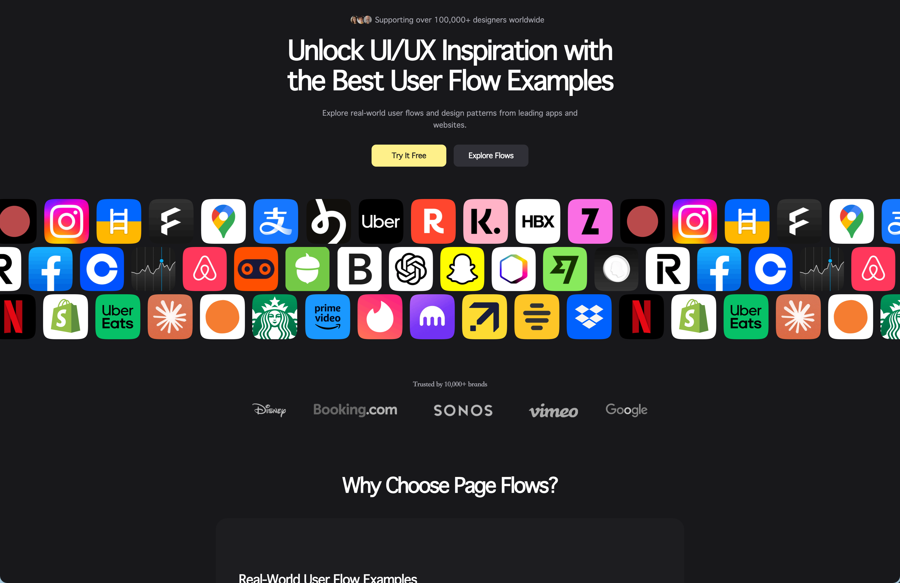
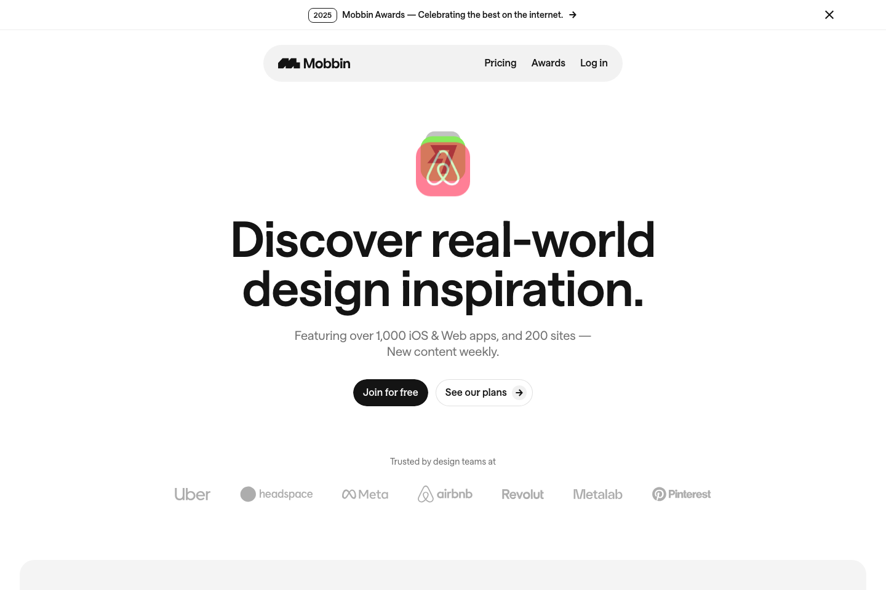
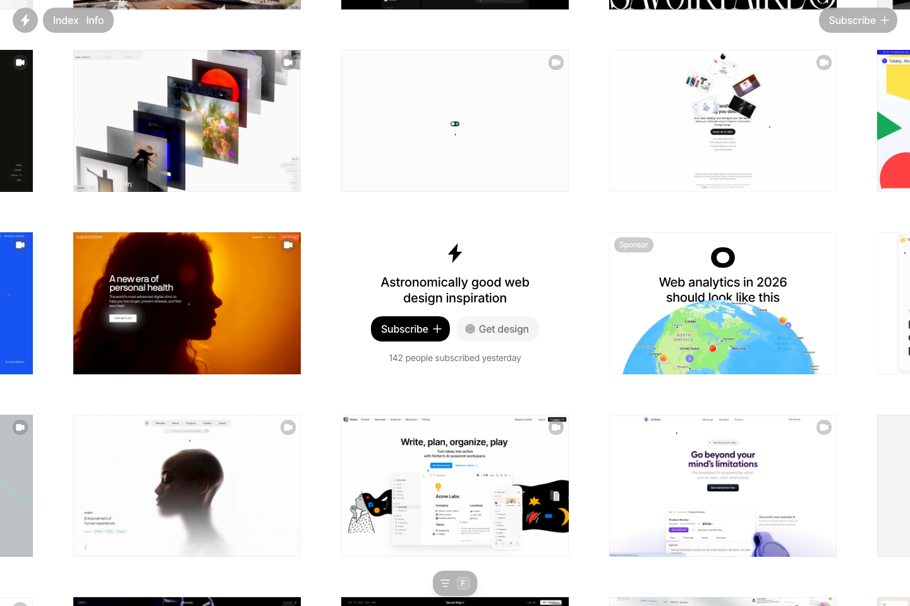
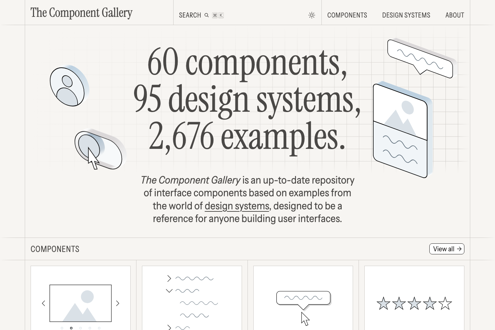
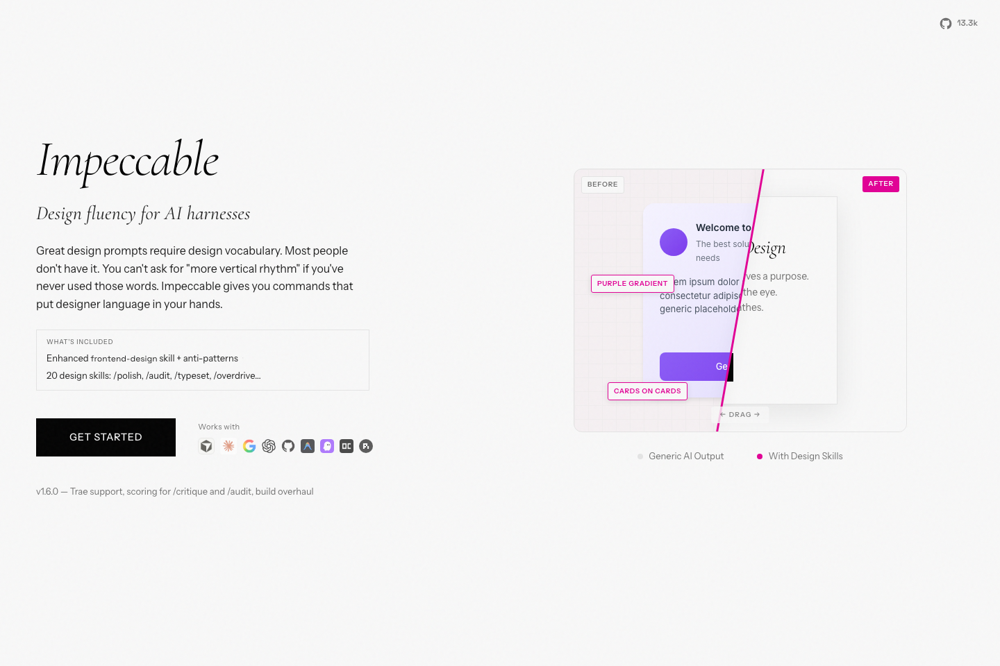

# awsome-frontend-reference

[English Version](README.md)

在线展示：[https://zenghao-stat.github.io/awsome-frontend-reference/](https://zenghao-stat.github.io/awsome-frontend-reference/)

前端设计与个人网页参考仓库。这里整理了一组常用灵感站点，并按分组表格记录 `Website / Intro / Screenshot`。

## 参考示例

| Website | Intro | Screenshot |
| --- | --- | --- |
| [Origin by Chris Shiflett](http://origin.shiflett.org/) | 一个完成度很高的个人网站示例，展示创业者、产品设计师和开发者的个人介绍与内容组织。 |  |
| [Paperclip](https://paperclip.ing/) | 视觉完成度很高的 AI 产品官网，可参考动效、排版和产品叙事方式。 |  |

## 参考示例的集合

| Website | Intro | Screenshot |
| --- | --- | --- |
| [SiteInspire](https://www.siteinspire.com/websites/category/personal) | 收录 personal 分类网页，适合快速查看个人网站的排版、字体和视觉风格。 |  |
| [Land-book](https://land-book.com/design/portfolio) | 以落地页和作品集为主的灵感库，适合参考 portfolio 的首屏结构和视觉节奏。 |  |
| [Page Flows](https://pageflows.com/) | 聚合真实产品的用户流程和界面模式，适合参考任务流程、转场和 UX 细节。 |  |
| [Mobbin](https://mobbin.com/) | 大型移动端和网页 UI 截图库，适合查界面模式、组件细节和交互参考。 |  |
| [Godly](https://godly.website/) | 精选高质量网站灵感，偏重品牌站、作品集和新产品官网的视觉表达。 |  |

## 前端组件

| Website | Intro | Screenshot |
| --- | --- | --- |
| [Component Gallery](https://component.gallery/) | 收集设计系统里的界面组件案例，适合查按钮、表单、导航等组件的常见做法。 |  |

## Skills

| Website | Intro | Screenshot |
| --- | --- | --- |
| [Impeccable](https://impeccable.style/) | 一个围绕 frontend-design skill 打造的专题站点，适合参考 skill 产品页面的文案组织、功能分层和视觉包装。 |  |
